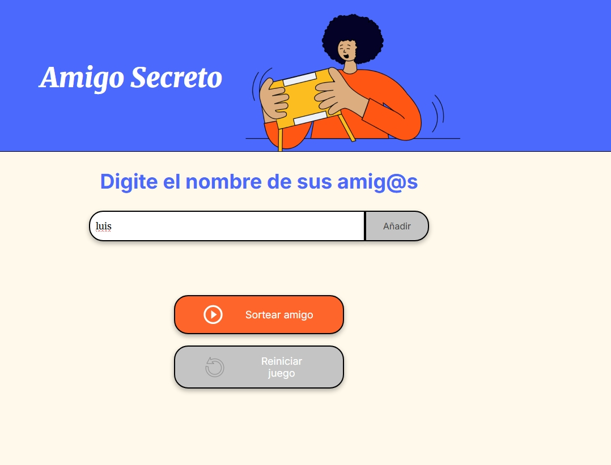

# challenge alura amigo secreto

Las tecnologias que se usaron fueron las siguientes:
Lenguaje de marcado de etiquetas HTML5,
Lenguaje de hojas de estilos en cascada CSS.
Lenguaje de programacion JavaScript.
Lenguaje de marcado Markdown (usado en el readme).

